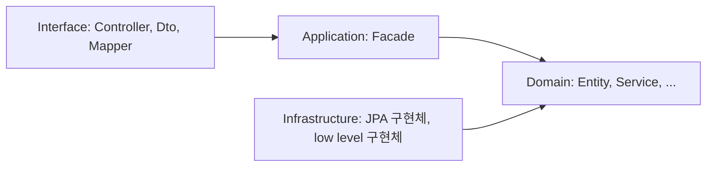
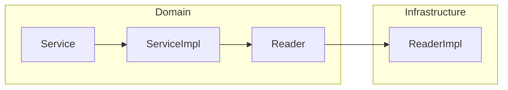
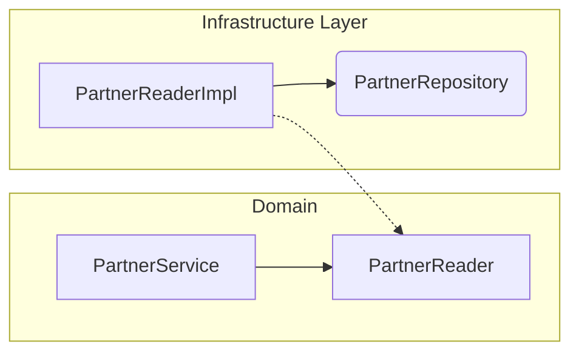

---
tags:
  - spring
---

# Layered Architecture
- https://velog.io/@hyun6ik/Layer-%EA%B3%84%EC%B8%B5
- Layer간의 단방향 의존관계
- 계층간 호출 = 인터페이스

## 구성 요소
### Interface
- 사용자에게 정보를 보여주고 해석
- e.g. Controller, Dto, Mapper(Converter)

### Application
- 수행할 작업 정의
- 표현력 있는 도메인 객체가 문제 해결하게 지시
- 업무상 중요하거나, 다른 시스템의 app 계층과 **상호 작용**시 필요한 부분
- 이 계층은 얇게 유지됨
- 오직 작업을 조정하고 아래에 위치한 계층에 포함된 **도메인 객체**의 협력자에게 작업 위임
- e.g. Facade

### Domain
- 업무 개념, 업무 상황 정보, 업무 규칙 표현
- 업무 상황 반영하는 상태 제어, 사용
- **기술적 세부사항은 Infrastructure에 위임**
- e.g. Entity, Service, Command, Criteria, Info, Reader, Store, Executor, Factory(Interface)

### Infrastructure
- 상위 계층을 지원하는 일반화된 **기술적 기능** 제공
- app에 대한 메세지 전송, 도메인 영속화, UI 위젯을 그리기
- e.g. low level 구현체(ReaderImpl, StoreImpl, Spring JPA, RedisConnector, ...)

### Layer간 참조 관계


## Domain Layer
### domain layer의 `Service`에서는 **해당 도메인의 전체 흐름**을 파악할 수 있어야 함
- 도메인은 어떤 기술은 중요하지 x
- 어떤 업무를 어떤 순서로 처리했는가
- 적절한 interface를 사용하여 추상화
  - 실제 구현은 다른 layer에 맡김
- 세부적 기술구현은 Service가 아니라 `infrastructure::implements` 클래스 위임
  - Service에서는 이를 활용하기 위한 interface 선언 및 사용
  - DIP 활용. 도메인이 사용하는 interface 실제 구현체 Injection
  - 영속화된 객체를 로딩하기 위해 `Spring JPA, QueryDSL`

### domain layer의 모든 클래스명이 `*Service` 선언 필요 x
- 하나의 도메인 패키지에 Service 클래스가 존재하면,
  - 도메인 전체의 흐름을 컨트롤 하는 `Service`가 무엇인지 파악이 어려움
- **주요 도메인 흐름 관리**는 `Service` 하나로 유지
  - support 클래스는 Service 이외의 네이밍
- 하나의 책임을 가져가는 각각의 구현체, 책임과 역할에 맞는 네이밍으로 선언
  - domain layer에는 interface로 추상화
  - infrastructure에서 구현체
- doamin layer, 도메인 로직의 흐름 표현
  - Service, ServiceImpl이 존재
  - 상세 구현은 Reader, Store, Executor Interface 선언 및 사용
  - 실제 구현체는 Infrastructure Layer에 두고 활용
- FLOW


### Service 간에는 참조 관계를 가지지 X
- DDD::Aggreate Root와 유사하게
  - domain내의 `Entity`간에도 상하관계가 있음
- Service로직 구현시에도 hierarchy가 존재
  - 하지만 이런 구조를 허용하면, 상위/하위레벨의 관계가 발생
  - 테스트 하기 어려워짐
- **Service 간에는 참조 관계를 가지지 않도록 원칙을 세우는 것이 좋음**
  - Service 로직은 추상화 수준이 높음
  - 각 추상화의 실제 구현체는 잘개 쪼갬
    - 도메인 전체 흐름 파악, 로직을 간결히 유지하도록

## Infrastructure Layer
- 상위 계층 지원, 일반화된 기술 기능 제공

### domain layer의 추상화 interface를 구현
- DIP 개념 활용


### 구현 자유도 확보
- domain의 추상화된 Interface 단순 구현
  - domain layer의 추상화가 존재하므로, 내부 구현을 자유롭게 할 수 있음

### Intrastructure layer의 구현체간 참조 허용
- Service 간의 참조는 x
- Service에 비해 상호 의존성을 많이 가지지 않음
- 로직의 재활용을 위해 infrastructure 내의 구현체를 **의존 관계** 활용 가능
- 단, **순환 참조**에 주의할 것
  - 적절한 상하관계 필요

### @Component 활용
- `@Service`, `@Component`를 구분하여 명시적 의미 부여

## Application Layer
- 수행할 작업 정의
- domain 객체가 문제 해결하도록 지시
- 다른 app과의 상호 작용
- Business Logic을 포함하지 x
  - 단순 작업 조정 및 하위 계층에서 domain 객체의 협력을 위해 업무 위임
- Layer는 얇게 유지
- **단순 작업 조정. 도메인의 상태를 가지면 x**

### App Layer의 특징 
- `transaction`으로 묶여야 하는 도메인 로직 및 그 외의 로직을 `aggregation`하는 역할
  - **하나의 메서드에 transaction 연관 메서드, 아닌 메서드 호출이 존재**
- 해당 로직이 두꺼워질 이유가 x

### Class Naming: `...Facade`라는 postfix를 가짐
- `Facade`
  - 본래 복잡한 여러개의 `API`를 하나의 `interface`로 aggregation
  - app layer의 Facade는, **서비스 간의 조합**으로
    - 하나의 요구사항을 처리하는 클래스

### Facade 구현 예시
- 주문 완료 및 카카오톡 주문 성공 알림
  - 주문 처리 과정 -> transaction으로 처리
  - 주문 완료 후 카카오톡 발송 실패 -> 주문 전체 로직 rollback 불필요
    - 알람 발송이 실패 했더라도, 메인 서비스를 통해 주문 완료 확인 가능
- Facade 코드 예시
  ```java
  public String completeOrder(OrderCommand.RegisterOrder registerOrder) {
      var orderToken : String = orderService.completeOrder(registerOrder);
      notificationService.sendKakao("ORDER_COMPLETE", "content");
      return orderToken;
  }
  ```
  - `Facade::completeOrder`는 `transaction`을 선언하지 x
  - `orderService::completeOrder` `transaction` 선언
    - 예외 발생시, `order aggregate`가 rollback
    - 정합성 확보
  - notificationService는 `transaction`을 선언하지 x
    - 주요 도메인 로직에 포함되지 않는 외부 서비스에 대해서는
    - 성공/실패에 민감하지 않게 요구사항 처리 가능

## Interfaces Layer
- 사용자에게 정보를 보여주고, 사용자의 명령 해석

### API 설계시, 불필요 Request Param 제거. Response 역시 최소로 유지
- 요구하는 `Request Param`이 많을 경우
  - 관련 메서드, 처리 로직이 복잡하다는 의미
  - 관련된 객체가 많은 역할을 하고 있음
- `Response`도 불필요한 응답 제공시,
  - 추후 해당 Response에서 특정 property 제거가 어려움
- **API는 한번 오픈되면 바꿀 수 없음**
  - 처음부터 제한적으로 구현할 것

### HTTP, gRPC, 비동기 메시징과 같은 통신 기술, Interfaces Layer에서만 사용
- JSON 처리 로직, http cookie 파싱 로직
  - Domain Layer에서 사용 X
- 만약 지키지 않을 경우,
  - 언제든지 교체될 수 있는 외부 통신 기술로 인해
  - domain 로직까지 변경될 수 있음
